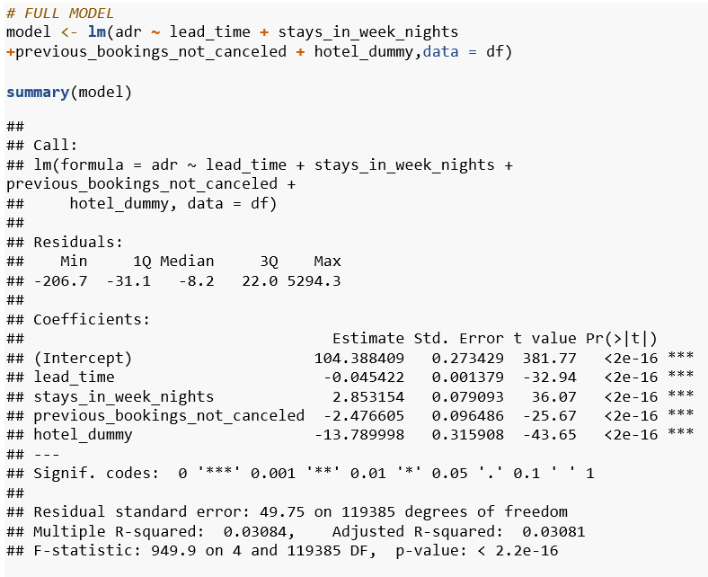
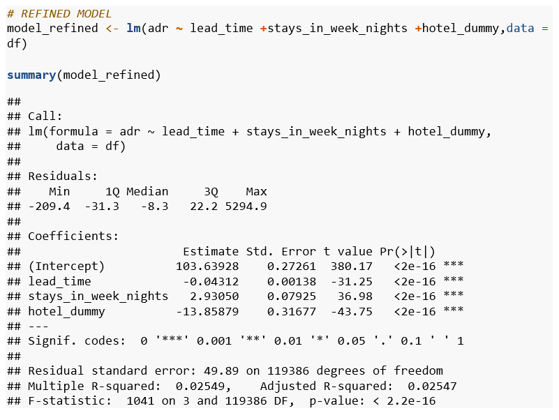
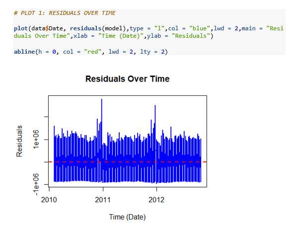
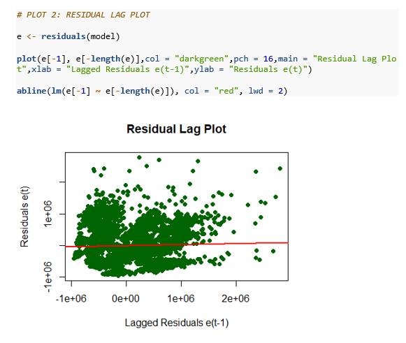
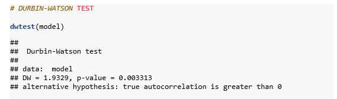
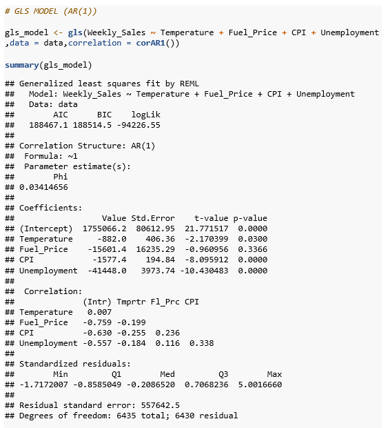
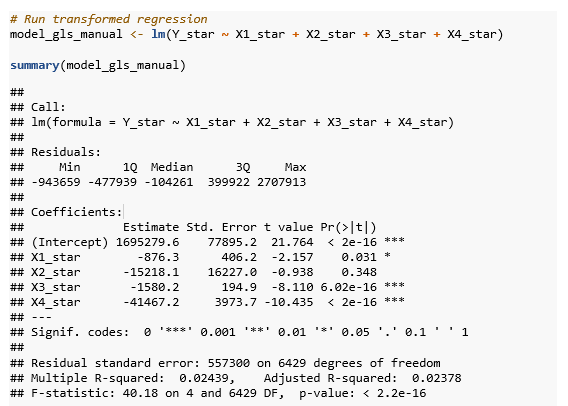
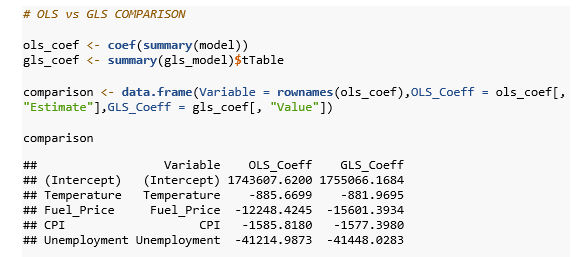
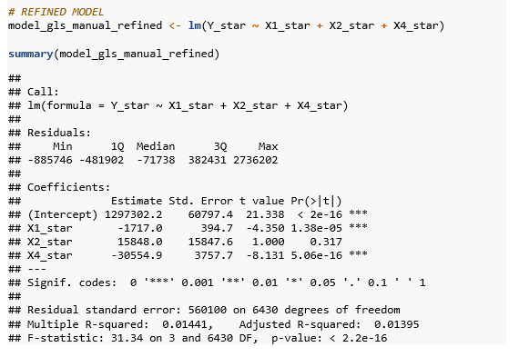

# 📊 Regression Analysis Assignment

> **R-based regression analysis covering Indicator (Dummy) Variables and Autocorrelation,**  
> **applied on real-world datasets from Kaggle.**

---

## 📌 Project Overview

This repository contains the complete submission for the **Regression Analysis** assignment as part of the **MSc in Statistics and Data Science** programme at **SVKM's Narsee Monjee Institute of Management Studies (NMIMS), Mumbai**.

| Detail | Value |
|---|---|
| Student | Omkar Navle |
| Roll No | A037 |
| SAP ID | 86062500050 |
| Programme | MSc Statistics and Data Science |
| Subject | Regression Analysis |
| Mentor | Mangesh Kutekar |
| Institution | Nilkamal School of Mathematics, Applied Statistics and Analytics, NMIMS Mumbai |
| Software | R (v4.3+) — R Markdown (.Rmd) |

---

## 📂 Repository Structure

```
regression-analysis-r/
│
├── code/
│   ├── Assignment1_Indicator_Variables.Rmd   ← Dummy variable regression
│   └── Assignment2_Autocorrelation.Rmd       ← Autocorrelation detection & correction
│
├── report/
│   ├── A037_Omkar_Navle_RA_Assignment.pdf    ← Full assignment report (PDF)
│   └── A037_Omkar_Navle_RA_Assignment.docx   ← Full assignment report (Word)
│
├── data/
│   └── dataset_info.md                       ← Dataset descriptions + Kaggle links
│
├── images/
│   ├── adr_boxplot_by_hotel_type.png
│   ├── full_model_output.png
│   ├── refined_model_output.png
│   ├── residuals_over_time.png
│   ├── residual_lag_plot.png
│   ├── histogram_of_residuals.png
│   ├── durbin_watson_test.png
│   ├── gls_model_output.png
│   ├── cochrane_orcutt_output.png
│   ├── ols_vs_gls_comparison.png
│   └── refined_gls_model.png
│
├── .gitignore
└── README.md
```

---

## 📘 Assignment 1 — Multiple Linear Regression with Indicator (Dummy) Variables

**Dataset:** Hotel Booking Demand | **Source:** [Kaggle](https://www.kaggle.com/datasets/jessemostipak/hotel-booking-demand)

### Objective

To investigate whether **hotel type** (City Hotel vs Resort Hotel) significantly affects the **Average Daily Rate (ADR)** after controlling for booking lead time and length of stay — using a dummy variable regression framework.

### Dataset at a Glance

| Attribute | Detail |
|---|---|
| Total Observations | 119,390 booking records |
| Total Variables | 32 columns |
| Dependent Variable | `adr` — Average Daily Rate (USD per night) |
| Qualitative Predictor | `hotel` → `hotel_dummy` (1 = Resort Hotel, 0 = City Hotel) |
| Numerical Predictors | `lead_time`, `stays_in_week_nights`, `previous_bookings_not_canceled` |
| Time Period | 2015 – 2017 |
| Missing Values | 4 in `children` — imputed with column mean |

---

### Step 1 — Data Loading and Missing Value Treatment

```r
df$children[is.na(df$children)] <- mean(df$children, na.rm = TRUE)
df$country[is.na(df$country)]   <- "Unknown"
df$agent[is.na(df$agent)]       <- 0
df$company[is.na(df$company)]   <- 0
```

---

### Step 2 — Creating the Dummy Variable

Since `hotel` has p = 2 categories, exactly p − 1 = 1 dummy is created. City Hotel is the reference category — its effect is absorbed into the intercept.

```r
df$hotel_dummy <- ifelse(df$hotel == "Resort Hotel", 1, 0)
```

**Boxplot — ADR by Hotel Type:**


The boxplot confirms a clear distributional difference in ADR between the two hotel types, justifying the inclusion of the dummy predictor.

---

### Step 3 — Full OLS Model

```r
model <- lm(adr ~ lead_time + stays_in_week_nights +
                  previous_bookings_not_canceled + hotel_dummy,
            data = df)
summary(model)
```



| Term | Estimate | t value | p-value |
|---|---|---|---|
| (Intercept) | 104.388 | 381.77 | < 2e-16 *** |
| lead_time | −0.045 | −32.94 | < 2e-16 *** |
| stays_in_week_nights | 2.853 | 36.07 | < 2e-16 *** |
| previous_bookings_not_canceled | −2.477 | −25.67 | < 2e-16 *** |
| hotel_dummy | −13.790 | −43.65 | < 2e-16 *** |

**Adjusted R² = 0.0308 | F-statistic = 949.9 (p < 2.2e-16)**

All predictors are statistically significant at the 1% level.

---

### Step 4 — Refined Model

`previous_bookings_not_canceled` removed for parsimony.

```r
model_refined <- lm(adr ~ lead_time + stays_in_week_nights + hotel_dummy,
                    data = df)
summary(model_refined)
```



| Term | Estimate | t value | p-value |
|---|---|---|---|
| (Intercept) | 103.639 | 380.17 | < 2e-16 *** |
| lead_time | −0.043 | −31.25 | < 2e-16 *** |
| stays_in_week_nights | 2.931 | 36.98 | < 2e-16 *** |
| hotel_dummy | −13.859 | −43.75 | < 2e-16 *** |

**Adjusted R² = 0.0255 | F-statistic = 1041 (p < 2.2e-16)**

---

### Interpretation of Coefficients

The refined model produces two parallel regression lines — one per hotel type:

**City Hotel (hotel_dummy = 0):**
```
ADR = 103.64 − 0.043 × lead_time + 2.931 × stays_in_week_nights
```

**Resort Hotel (hotel_dummy = 1):**
```
ADR = 89.78 − 0.043 × lead_time + 2.931 × stays_in_week_nights
```

| Variable | Coefficient | Interpretation |
|---|---|---|
| (Intercept) | 103.639 | Baseline ADR for City Hotel with zero lead time and no weeknight stays |
| lead_time | −0.043 | Each extra day of advance booking reduces ADR by ~$0.04 (early-bird discounting) |
| stays_in_week_nights | 2.931 | Each additional weeknight adds ~$2.93 to the nightly rate |
| hotel_dummy | −13.859 | Resort Hotels average **$13.86 less** per night than City Hotels, all else equal |

> **Insight:** The negative dummy coefficient reflects the urban business travel premium — city hotels serve corporate clients booking last-minute for short stays, commanding higher rates.

---

## 📗 Assignment 2 — Autocorrelation in Time-Series Regression

**Dataset:** Walmart Sales Dataset | **Source:** [Kaggle](https://www.kaggle.com/datasets/yasserh/walmart-dataset)

### Objective

To detect and correct **autocorrelation** in OLS residuals from a weekly retail sales regression model using graphical diagnostics, the Durbin-Watson test, GLS (AR(1)), and the Cochrane-Orcutt transformation.

### Dataset at a Glance

| Variable | Type | Description |
|---|---|---|
| `Weekly_Sales` (Y) | Numerical | Total weekly revenue per store (USD) — Dependent variable |
| `Temperature` | Numerical | Regional average temperature (°F) |
| `Fuel_Price` | Numerical | Regional fuel price (USD/gallon) |
| `CPI` | Numerical | Consumer Price Index |
| `Unemployment` | Numerical | Regional unemployment rate (%) |
| `Date` | Date | Week ending date — sorted chronologically |

**Total Observations:** 6,435 | **Period:** Feb 2010 – Oct 2012 | **Stores:** 45

---

### Step 1 — OLS Regression Model

```r
model <- lm(Weekly_Sales ~ Temperature + Fuel_Price + CPI + Unemployment,
            data = data)
summary(model)
```


| Term | Estimate | t value | p-value |
|---|---|---|---|
| (Intercept) | 1,743,607.6 | 21.918 | < 2e-16 *** |
| Temperature | −885.7 | −2.235 | 0.0254 * |
| Fuel_Price | −12,248.4 | −0.778 | 0.4368 |
| CPI | −1,585.8 | −8.126 | 5.3e-16 *** |
| Unemployment | −41,215.0 | −10.375 | < 2e-16 *** |

**Adjusted R² = 0.0237 | F-statistic = 40.09 (p < 2.2e-16)**

CPI and Unemployment are strong negative predictors. `Fuel_Price` is not significant (p = 0.437). Standard errors may be understated due to autocorrelation — must be tested formally.

---

### Step 2 — Detection of Autocorrelation

**Plot 1 — Residuals Over Time:**



Long runs of positive residuals followed by long runs of negative residuals — the classic visual signature of **positive autocorrelation**.

**Plot 2 — Residual Lag Plot:**



A clear positive linear relationship between e(t) and e(t−1) confirms that consecutive residuals are correlated.

**Plot 3 — Histogram of Residuals:**


Roughly symmetric but right-skewed, with a long positive tail driven by high-sales holiday weeks.

---

### Step 3 — Durbin-Watson Test

```r
dwtest(model)
```



| Component | Value | Interpretation |
|---|---|---|
| DW Statistic | 1.9329 | Below 2 — indicates positive autocorrelation |
| p-value | 0.003313 | Highly significant — reject H₀ at 1% level |
| Decision | **Reject H₀** | Positive autocorrelation confirmed |
| Estimated ρ | 0.03346 | Mild but real first-order serial correlation |

---

### Step 4 — GLS Correction (AR(1) via nlme)

```r
gls_model <- gls(Weekly_Sales ~ Temperature + Fuel_Price + CPI + Unemployment,
                 data = data, correlation = corAR1())
summary(gls_model)
```



Estimated AR(1) **Phi = 0.034** | Residual SE = 557,642.5

---

### Step 5 — Manual Cochrane-Orcutt Transformation

```r
rho     <- sum(e[-1] * e[-length(e)]) / sum(e[-length(e)]^2)
Y_star  <- Y[-1]  - rho * Y[-length(Y)]
X1_star <- X1[-1] - rho * X1[-length(X1)]
# ... repeated for all predictors
model_gls_manual <- lm(Y_star ~ X1_star + X2_star + X3_star + X4_star)
```



---

### Step 6 — OLS vs GLS Comparison



| Variable | OLS Coefficient | GLS Coefficient | Key Change |
|---|---|---|---|
| (Intercept) | 1,743,607.6 | 1,755,066.2 | Slight increase |
| Temperature | −885.7 | −882.0 | Stable, significant |
| Fuel_Price | −12,248.4 | −15,601.4 | Still **insignificant** (p = 0.337) |
| CPI | −1,585.8 | −1,577.4 | Very stable — robust predictor |
| Unemployment | −41,215.0 | −41,448.0 | Highly stable — strongest predictor |

---

### Step 7 — Refined GLS Model

`Fuel_Price` dropped — consistently insignificant across OLS and GLS.

```r
model_gls_manual_refined <- lm(Y_star ~ X1_star + X2_star + X4_star)
summary(model_gls_manual_refined)
```



---

### Summary and Conclusions

| Step | Action | Finding |
|---|---|---|
| 1 | OLS Regression | CPI and Unemployment significant; Fuel_Price not significant |
| 2 | Residual Plots | Cyclical clustering in time plot; positive pattern in lag plot |
| 3 | Durbin-Watson Test | DW = 1.9329, p = 0.003 — autocorrelation confirmed |
| 4 | GLS (nlme) | AR(1) Phi = 0.034; Fuel_Price still insignificant |
| 5 | Cochrane-Orcutt | rho = 0.033 — confirms GLS result |
| 6 | Refined Model | Temperature and Unemployment are the robust predictors |

> **Key Takeaway:** Even mild autocorrelation distorts standard errors and should never be ignored. The GLS Cochrane-Orcutt correction restores valid inference. CPI and Unemployment are the dominant drivers of weekly retail sales — consistent with economic theory that both suppress consumer purchasing power.

---

## 🛠️ How to Run

### Prerequisites

- **R** (v4.3+) → [cran.r-project.org](https://cran.r-project.org/)
- **RStudio** → [posit.co/downloads](https://posit.co/downloads/)

```r
install.packages(c("readr", "lmtest", "nlme"))
```

### Steps

```bash
git clone https://github.com/your-username/regression-analysis-r.git
cd regression-analysis-r
```

1. Download datasets from Kaggle (see `data/dataset_info.md` for links)
2. Place `hotel_bookings.csv` and `Walmart.csv` in the repo root
3. Open `.Rmd` files in RStudio
4. Click **Knit → Knit to Word** (or HTML)

---

## 📦 R Packages Used

| Package | Purpose |
|---|---|
| `readr` | Fast CSV loading with `read_csv()` |
| `lmtest` | Durbin-Watson test via `dwtest()` |
| `nlme` | GLS with AR(1) correlation via `gls()` |
| Base R | `lm()`, `summary()`, `plot()`, `hist()`, `boxplot()` |

---

## 📄 Report

Full written report available in `report/`:

📋 [`A037_Omkar_Navle_RA_Assignment.pdf`](report/A037_Omkar_Navle_RA_Assignment.pdf)

---

## 🔗 References

1. IGNOU. *Autocorrelation* (Unit 7). https://egyankosh.ac.in/bitstream/123456789/78535/1/Unit-12.pdf
2. IGNOU. *Regression Models with Indicator Variables* (Unit 9). https://egyankosh.ac.in/bitstream/123456789/88184/1/Unit-9.pdf
3. Hotel Booking Demand Dataset. https://www.kaggle.com/datasets/jessemostipak/hotel-booking-demand
4. Walmart Sales Dataset. https://www.kaggle.com/datasets/yasserh/walmart-dataset

---

## 📜 Licence

Submitted as academic coursework for the MSc Statistics and Data Science programme at NMIMS Mumbai.
Datasets are publicly available on Kaggle under their respective licences.
Code, analysis, and report content are original work by Omkar Navle.

---

*Built with R · NMIMS Mumbai · March 2026*
